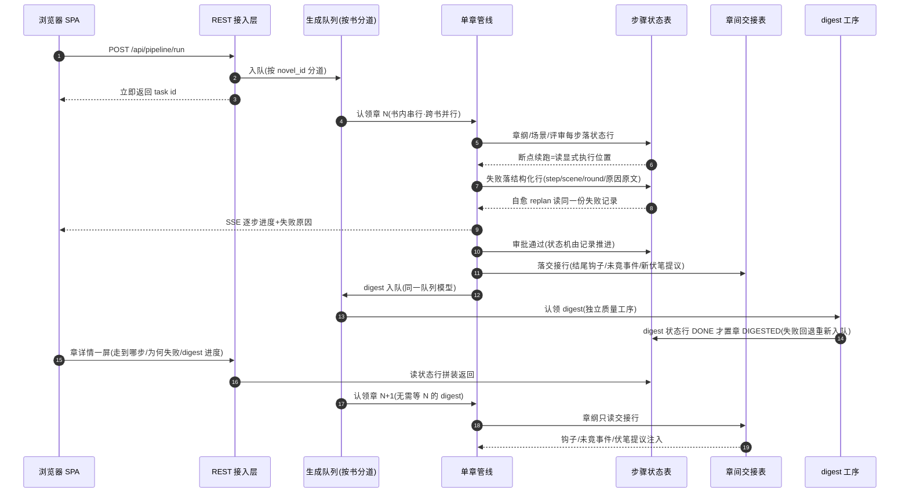
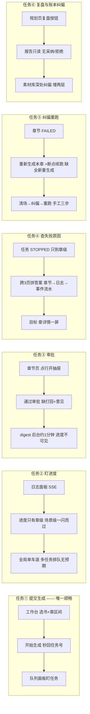
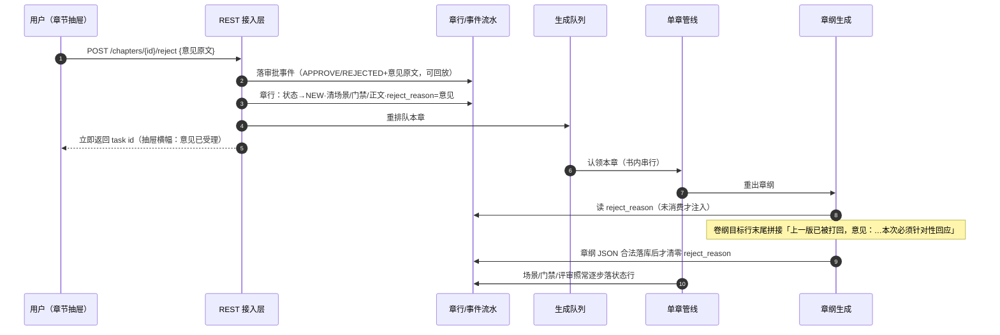
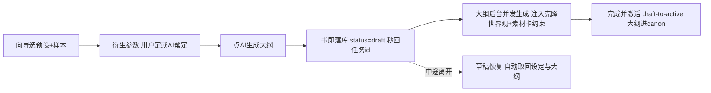
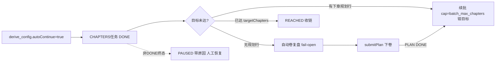

# 生成管线契约（文本源）

> **改契约先改这个文件**，HTML 图（pipeline-sequence.html / ui-workflow.html）是展示生成物，允许滞后。
> 三图分工：组件图=有什么（现状拓扑），本文=怎么传+怎么用（目标契约），施工以本文为准。

## 一、修正后时序（mermaid 源）

## 二、四条契约（验收口径）

1. **章间交接物**：章 N 过审即落交接行；章 N+1 章纲只读交接行，不等 digest。digest 降级为后台质量工序，落后不阻塞主链。现状痛点：`ChapterPipelineService` 注释自认"下一章上下文依赖本章 digest"，靠 prevChapterBrief 两套回退打补丁。
2. **每步有状态**：章纲/场景/评审轮/digest 各有状态行，章节状态机只由记录推进；断点续跑=读显式执行位置，不再靠场景 PASSED 隐式约定；`healOrphanedApproved` 启动补偿扫描随之删除。
3. **按书分道**：队列按 novel_id 分 worker，书内串行保因果、跨书并行互不阻塞；人工审批的 digest 并入同一队列模型，废除 `digestExecutor` 裸单线程。现状痛点：全系统一个 worker，A 跑一卷 B 排 6 小时。
4. **失败原因结构化**：未过/异常落一行（step/scene/round/原因原文），replan、队列消息、前端详情三个消费方读同一份。现状痛点：attemptChapter 吞异常，failureReason 捞不到给兜底废话。

## 三、UI 操作流（mermaid 源）

### 四个没有终点的任务（做 UI 时先补这四个入口）

| 缺口 | 现状 | 目标 |
|---|---|---|
| 全新重生成 | 断点续跑冒充重跑，干净重来只能手工清库 | 一键全新重生成（清场+重跑一个端点） |
| 打回+意见 | 审批只有「通过」 | 打回+一句话意见进 replan 上下文 |
| 复盘建议采纳 | 报告只读 | 单条建议采纳/拒绝，采纳即注入下卷规划 |
| digest 后台进度 | 审批后干等，失败只回退状态 | 队列/章详情可见 digest 状态行 |

### 一屏答案清单（章详情页验收标准）

章详情一屏回答：走到哪步（状态行）／为何失败（结构化失败行）／digest 进度（digest 状态行）／当时评审口径（review_config 随章快照，已有）。

## 四、人侧操作流契约（同一四缺陷，另一个患者）

> 人没被画进时序图——SPA 在图上只是黑盒生命线。以下把四条人流按同样四缺陷立契约。
> 原则：前端只是记录的投影；每条流的「展示」坏了，根子都是「记」「传」缺失。

### 流 0 随时停止（人的意志 = 硬中断）

**停止 ≠ 回滚**：机器的一致性由「每步原子落一行」保证，不靠「不许打断」保证。人按停止 = 立即生效：

1. 中断当前在飞 LLM 调用（连接断开、结果作废），且不再发起后续调用——无「等本章结束」；
2. 中断后的世界如实标注：章节状态 `INTERRUPTED`，状态行写明「中断于场景 N/M」，已完成产物保留、不粉饰；
3. 重跑由人选：续跑（复用已完成）或全新重生成；
4. 取消指令落库（替换内存 Set），重启不丢。

现状三障碍（全属契约②③施工范围）：取消标志在内存；LLM 客户端同步阻塞、调用不可弃；步骤无状态行导致中断无法标注位置，只能退化为章边界协作取消（滞后最长 35 分钟）。卷纲 auto-plan/章纲 regenerate/卷复盘/digest 无取消通道，需先任务化。

### 流 A 审批（设计书 v1，待拍板 1-5 后施工）

> **人工通道是常设能力，不是 manual 开关的专属品**。设计=混合审批（默认 auto），实现曾把"默认"读成"只此一种"：manual 路径上线以来每次审批 500（APPROVED 状态值撞 CHECK）一个月无人发现——通道名存实亡的实证。auto 模式下人在环内三权，缺一不可：
> - **停止权**（=流 0）；
> - **插队权**：跑批中随时「下一章生成前暂停」，一次性人工卡点，看完放行或当场切 manual；
> - **事后否决权**：对已 DIGESTED 章打回+意见→重生成→digest 重算（依赖 backlog「digest 与审批解耦」，解耦前否决仅限 PENDING_APPROVAL）。

v1 范围：PENDING_APPROVAL 打回+意见（下表 1-5）；插队权与事后否决权在 digest 解耦后追加。

目标时序：

设计决定（待拍板）：

| # | 决定点 | 方案 | 备选 |
|---|---|---|---|
| 1 | 意见怎么进提示词 | 拼接进卷纲目标行末尾，不动 prompt_templates（零目录哈希扰动） | 模板加占位符（26 条目录全要对齐） |
| 2 | 打回历史记哪 | pipeline_events 事件（可回放），独立 approval_records 表要查账时再建 | 现在就建表（MP 四层全套仪式） |
| 3 | 打回范围 | 仅 PENDING_APPROVAL；FAILED 章继续走既有「重新生成本章」 | FAILED 也可打回（状态机多一条边） |
| 4 | 重生成语义 | 全量重生成+意见（章纲重出，场景全重建）；局部重写属另一契约 | 保留未点名场景（复用判定复杂，容易假修复） |
| 5 | 调参数值 | 行为键零新增（打回次数/尺度由人当场决定，不折算成阈值；既有 20 键与三级覆盖照常生效）。唯一新键 `reject_reason_max_len`（默认 200）：意见注入长度护栏，走 TuningService fail-open，前端 maxlength 同源 | 硬编码常量（改一次发一版） |

边界情况：并发双击→条件更新（仅 PENDING_APPROVAL 可打回），第二次 A0006；进程重启→意见在章行上不丢，RUNNING 任务自动重排；章纲 LLM 失败→意见未清零，下次尝试仍在；空意见→A0001 拒绝；digest 无打回路径（打回只发生在 digest 之前）。

验收标准：一个按钮、一次输入、意见原文在抽屉可见且清零时机正确、重排队任务在工作台可见、全程零同步长请求。

（原四缺陷速记）**记**：审批行 =（章，动作[通过/打回]，意见原文，时间）；**传**：意见原文注入章纲提示词（replanChapter 通道备用，v1 不走）；**展示**：审批一屏带上下文 = 当前正文 + 上一轮被拦原因 + 评审口径快照；**异步**：接口秒回，LLM 全在队列。

### 流 B 观察（进度/失败）
- **记**：步骤状态行（章纲/场景/评审/digest 各自 RUNNING/DONE/FAILED+位置）——SSE 只做推送不做存储
- **传**：失败行 → 列表 hover / 抽屉横幅 / replan / 队列消息，四处同源
- **展示**：章详情 = 状态行投影一屏，不跨页
- **异步**：队列按书分道，等待有预期（排队位置可见）

### 流 C 重跑
- **记**：清场动作落痕（清了什么场景/报告），执行位置显式化，不靠 PASSED 隐式推断
- **传**：重跑意图（forceFresh / 打回意见）进任务行参数，不靠复用语义猜
- **展示**：重跑前明示「复用 X 场景 / 全新重生成」
- **异步**：清场→纠偏→重跑串成一个端点，内部异步，人只发一次指令

### 流 D 复盘采纳
- **记**：建议条目有采纳/拒绝状态（现状报告只读）
- **传**：采纳条目 → 下卷规划上下文（FixB 自动注入已有，单条人工决策无通道）
- **展示**：报告条目上直接操作，决策后状态可见
- **异步**：采纳动作只写记录，规划时才消费，不阻塞

## 五、样本资产化与衍生量产契约（2026-09-25 增补）

> 本节为 2026-09-24/25 八批功能的契约补记。此前施工未先改本文，违反「改契约先改这个文件」——补记同时立此存照：**后续任何批次，完工前必须回写本文，否则不得 commit**。

### 流 S：样本导入与深度解析

验收口径：①语料与资产全部落库（preset_corpus/imported_samples/sample_plot_nodes/sample_cards），删除仅软删；②FAST→FULL 升级与重启恢复不重析已析章（UNIQUE(sample,level,seq)）；③解析失败留缺口可续跑，不产生半截资产展示；④mobi/azw3 无 DRM 可提取，DRM/HUFF 人话拒绝。

### 流 D：衍生开书与草稿态

验收口径：①生大纲即落库，书籍管理页立即可见（状态=草稿）；②克隆样本资产时 AI 大纲必须贴合克隆世界（derive_outline/world 段，PromptCatalog 可编辑）——否则卷规划审校必打回（书 9 实证）；③克隆预设的章长带约束卷规划预算；④掺水量/POV/标签/每卷章数/目标/无人续跑全参数书级可改（PUT derive-config，fail-open）。**已知约束**：克隆世界观与 AI 自创大纲是组合风险，向导须提示（TODO：勾选联动警告）。

### 流 C：无人续跑链

验收口径：①链状态三列（auto_state/auto_message/auto_volumes）可观测，工作台状态卡展示；②用户停止/失败耗尽/规划失败 → 链必 PAUSED 且原因可读；③resume 允许解卡（RUNNING 但无活动任务）；④保险丝 auto_continue_max_volumes 防失控；⑤队列认领 priority DESC,id ASC。

### 书籍管理契约

查（GET /api/novels 含无人续跑读数）/改（PUT，书名全站唯一）/删（DELETE 软删；有活动任务拒绝；autoContinue 自动关闭+链置 OFF）/打开（设当前书→章节页）。删书相关 TODO：级联展示（书删后素材/任务在书外页签仍可见的口径）待产品定。
