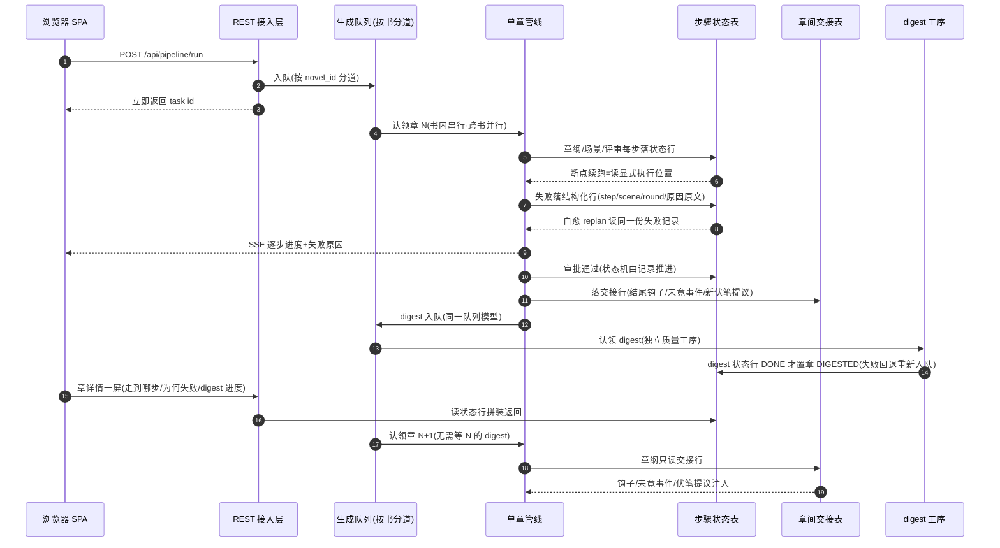
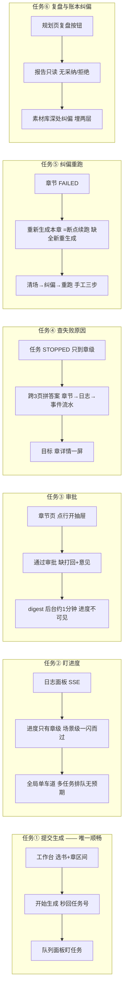
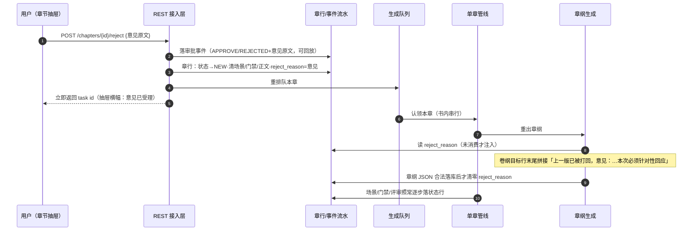
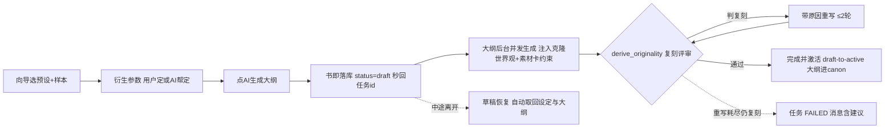
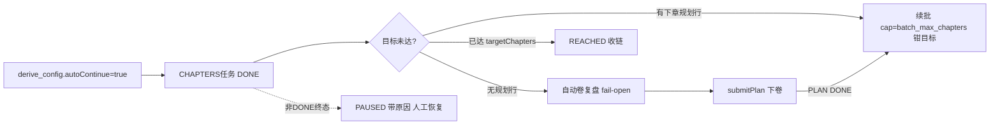

# 生成管线契约（文本源）

> **改契约先改这个文件**，HTML 图（pipeline-sequence.html / ui-workflow.html）是展示生成物，允许滞后。
> 三图分工：组件图=有什么（现状拓扑），本文=怎么传+怎么用（目标契约），施工以本文为准。

## 一、修正后时序（mermaid 源）

```mermaid
sequenceDiagram
    autonumber
    participant SPA as 浏览器 SPA
    participant API as REST 接入层
    participant Q as 生成队列(按书分道)
    participant P as 单章管线
    participant ST as 步骤状态表
    participant HO as 章间交接表
    participant DG as digest 工序

    SPA->>API: POST /api/pipeline/run
    API->>Q: 入队(按 novel_id 分道)
    API-->>SPA: 立即返回 task id

    Q->>P: 认领章 N(书内串行·跨书并行)
    P->>ST: 章纲/场景/评审每步落状态行
    ST-->>P: 断点续跑=读显式执行位置
    P->>ST: 失败落结构化行(step/scene/round/原因原文)
    ST-->>P: 自愈 replan 读同一份失败记录
    P-->>SPA: SSE 逐步进度+失败原因

    P->>ST: 审批通过(状态机由记录推进)
    P->>HO: 落交接行(结尾钩子/未竟事件/新伏笔提议)
    P->>Q: digest 入队(同一队列模型)
    Q->>DG: 认领 digest(独立质量工序)
    DG->>ST: digest 状态行 DONE 才置章 DIGESTED(失败回退重新入队)

    SPA->>API: 章详情一屏(走到哪步/为何失败/digest 进度)
    API->>ST: 读状态行拼装返回

    Q->>P: 认领章 N+1(无需等 N 的 digest)
    P->>HO: 章纲只读交接行
    HO-->>P: 钩子/未竟事件/伏笔提议注入
```

## 二、四条契约（验收口径）

1. **章间交接物**：章 N 过审即落交接行；章 N+1 章纲只读交接行，不等 digest。digest 降级为后台质量工序，落后不阻塞主链。现状痛点：`ChapterPipelineService` 注释自认"下一章上下文依赖本章 digest"，靠 prevChapterBrief 两套回退打补丁。
2. **每步有状态**：章纲/场景/评审轮/digest 各有状态行，章节状态机只由记录推进；断点续跑=读显式执行位置，不再靠场景 PASSED 隐式约定；`healOrphanedApproved` 启动补偿扫描随之删除。
3. **按书分道**：队列按 novel_id 分 worker，书内串行保因果、跨书并行互不阻塞；人工审批的 digest 并入同一队列模型，废除 `digestExecutor` 裸单线程。现状痛点：全系统一个 worker，A 跑一卷 B 排 6 小时。
4. **失败原因结构化**：未过/异常落一行（step/scene/round/原因原文），replan、队列消息、前端详情三个消费方读同一份。现状痛点：attemptChapter 吞异常，failureReason 捞不到给兜底废话。

## 三、UI 操作流（mermaid 源）

```mermaid
flowchart LR
    subgraph G1[任务① 提交生成 —— 唯一顺畅]
        A1[工作台 选书+章区间] --> A2[开始生成 秒回任务号] --> A3[队列面板盯任务]
    end
    subgraph G2[任务② 盯进度]
        B1[日志面板 SSE] --> B2[进度只有章级 场景级一闪而过] --> B3[全局单车道 多任务排队无预期]
    end
    subgraph G3[任务③ 审批]
        C1[章节页 点行开抽屉] --> C2[通过审批 缺打回+意见] --> C3[digest 后台约1分钟 进度不可见]
    end
    subgraph G4[任务④ 查失败原因]
        D1[任务 STOPPED 只到章级] --> D2[跨3页拼答案 章节→日志→事件流水] --> D3[目标 章详情一屏]
    end
    subgraph G5[任务⑤ 纠偏重跑]
        E1[章节 FAILED] --> E2[重新生成本章 =断点续跑 缺全新重生成] --> E3[清场→纠偏→重跑 手工三步]
    end
    subgraph G6[任务⑥ 复盘与账本纠偏]
        F1[规划页复盘按钮] --> F2[报告只读 无采纳/拒绝] --> F3[素材库深处纠偏 埋两层]
    end
```

### 四个没有终点的任务（做 UI 时先补这四个入口）

| 缺口 | 现状 | 目标 |
|---|---|---|
| 全新重生成 | 断点续跑冒充重跑，干净重来只能手工清库 | 一键全新重生成（清场+重跑一个端点） |
| 打回+意见 | 审批只有「通过」 | 打回+一句话意见进 replan 上下文 |
| 复盘建议采纳 | 报告只读 | 单条建议采纳/拒绝，采纳即注入下卷规划 |
| digest 后台进度 | 审批后干等，失败只回退状态 | 队列/章详情可见 digest 状态行 |

### 一屏答案清单（章详情页验收标准）

章详情一屏回答：走到哪步（状态行）／为何失败（结构化失败行）／digest 进度（digest 状态行）／当时评审口径（review_config 随章快照，已有）。

## 四、人侧操作流契约（同一四缺陷，另一个患者）

> 人没被画进时序图——SPA 在图上只是黑盒生命线。以下把四条人流按同样四缺陷立契约。
> 原则：前端只是记录的投影；每条流的「展示」坏了，根子都是「记」「传」缺失。

### 流 0 随时停止（人的意志 = 硬中断）

**停止 ≠ 回滚**：机器的一致性由「每步原子落一行」保证，不靠「不许打断」保证。人按停止 = 立即生效：

1. 中断当前在飞 LLM 调用（连接断开、结果作废），且不再发起后续调用——无「等本章结束」；
2. 中断后的世界如实标注：章节状态 `INTERRUPTED`，状态行写明「中断于场景 N/M」，已完成产物保留、不粉饰；
3. 重跑由人选：续跑（复用已完成）或全新重生成；
4. 取消指令落库（替换内存 Set），重启不丢。

现状三障碍（全属契约②③施工范围）：取消标志在内存；LLM 客户端同步阻塞、调用不可弃；步骤无状态行导致中断无法标注位置，只能退化为章边界协作取消（滞后最长 35 分钟）。卷纲 auto-plan/章纲 regenerate/卷复盘/digest 无取消通道，需先任务化。

### 流 A 审批（设计书 v1，待拍板 1-5 后施工）

> **人工通道是常设能力，不是 manual 开关的专属品**。设计=混合审批（默认 auto），实现曾把"默认"读成"只此一种"：manual 路径上线以来每次审批 500（APPROVED 状态值撞 CHECK）一个月无人发现——通道名存实亡的实证。auto 模式下人在环内三权，缺一不可：
> - **停止权**（=流 0）；
> - **插队权**：跑批中随时「下一章生成前暂停」，一次性人工卡点，看完放行或当场切 manual；
> - **事后否决权**：对已 DIGESTED 章打回+意见→重生成→digest 重算（依赖 backlog「digest 与审批解耦」，解耦前否决仅限 PENDING_APPROVAL）。

v1 范围：PENDING_APPROVAL 打回+意见（下表 1-5）；插队权与事后否决权在 digest 解耦后追加。

目标时序：

```mermaid
sequenceDiagram
    autonumber
    participant U as 用户（章节抽屉）
    participant API as REST 接入层
    participant ST as 章行/事件流水
    participant Q as 生成队列
    participant P as 单章管线
    participant O as 章纲生成
    U->>API: POST /chapters/{id}/reject {意见原文}
    API->>ST: 落审批事件（APPROVE/REJECTED+意见原文，可回放）
    API->>ST: 章行：状态→NEW·清场景/门禁/正文·reject_reason=意见
    API->>Q: 重排队本章
    API-->>U: 立即返回 task id（抽屉横幅：意见已受理）
    Q->>P: 认领本章（书内串行）
    P->>O: 重出章纲
    O->>ST: 读 reject_reason（未消费才注入）
    Note over O: 卷纲目标行末尾拼接「上一版已被打回，意见：…本次必须针对性回应」
    O->>ST: 章纲 JSON 合法落库后才清零 reject_reason
    P->>ST: 场景/门禁/评审照常逐步落状态行
```

设计决定（待拍板）：

| # | 决定点 | 方案 | 备选 |
|---|---|---|---|
| 1 | 意见怎么进提示词 | 拼接进卷纲目标行末尾；注入句本体落库 outline/reject_suffix（{reason} 拼接段，库值可编辑）——2026-09-25 提示词全量接库收尾时从内联迁入 | 模板加占位符（目录全要对齐） |
| 2 | 打回历史记哪 | pipeline_events 事件（可回放），独立 approval_records 表要查账时再建 | 现在就建表（MP 四层全套仪式） |
| 3 | 打回范围 | 仅 PENDING_APPROVAL；FAILED 章继续走既有「重新生成本章」 | FAILED 也可打回（状态机多一条边） |
| 4 | 重生成语义 | 全量重生成+意见（章纲重出，场景全重建）；局部重写属另一契约 | 保留未点名场景（复用判定复杂，容易假修复） |
| 5 | 调参数值 | 行为键零新增（打回次数/尺度由人当场决定，不折算成阈值；既有 20 键与三级覆盖照常生效）。唯一新键 `reject_reason_max_len`（默认 200）：意见注入长度护栏，走 TuningService fail-open，前端 maxlength 同源 | 硬编码常量（改一次发一版） |

边界情况：并发双击→条件更新（仅 PENDING_APPROVAL 可打回），第二次 A0006；进程重启→意见在章行上不丢，RUNNING 任务自动重排；章纲 LLM 失败→意见未清零，下次尝试仍在；空意见→A0001 拒绝；digest 无打回路径（打回只发生在 digest 之前）。

验收标准：一个按钮、一次输入、意见原文在抽屉可见且清零时机正确、重排队任务在工作台可见、全程零同步长请求。

（原四缺陷速记）**记**：审批行 =（章，动作[通过/打回]，意见原文，时间）；**传**：意见原文注入章纲提示词（replanChapter 通道备用，v1 不走）；**展示**：审批一屏带上下文 = 当前正文 + 上一轮被拦原因 + 评审口径快照；**异步**：接口秒回，LLM 全在队列。

### 流 B 观察（进度/失败）
- **记**：步骤状态行（章纲/场景/评审/digest 各自 RUNNING/DONE/FAILED+位置）——SSE 只做推送不做存储
- **传**：失败行 → 列表 hover / 抽屉横幅 / replan / 队列消息，四处同源
- **展示**：章详情 = 状态行投影一屏，不跨页
- **异步**：队列按书分道，等待有预期（排队位置可见）

### 流 C 重跑
- **记**：清场动作落痕（清了什么场景/报告），执行位置显式化，不靠 PASSED 隐式推断
- **传**：重跑意图（forceFresh / 打回意见）进任务行参数，不靠复用语义猜
- **展示**：重跑前明示「复用 X 场景 / 全新重生成」
- **异步**：清场→纠偏→重跑串成一个端点，内部异步，人只发一次指令

### 流 D 复盘采纳
- **记**：建议条目有采纳/拒绝状态（现状报告只读）
- **传**：采纳条目 → 下卷规划上下文（FixB 自动注入已有，单条人工决策无通道）
- **展示**：报告条目上直接操作，决策后状态可见
- **异步**：采纳动作只写记录，规划时才消费，不阻塞

## 五、样本资产化与衍生量产契约（2026-09-25 增补）

> 本节为 2026-09-24/25 八批功能的契约补记。此前施工未先改本文，违反「改契约先改这个文件」——补记同时立此存照：**后续任何批次，完工前必须回写本文，否则不得 commit**。

### 流 S：样本导入与深度解析

```mermaid
flowchart LR
    A[导入 txt/mobi] --> B[analyze 秒级 文风指纹+切块落库+台账行]
    B --> C[深度解析 FAST抽样40章 / FULL全书]
    C --> D[逐章 sample_chapter 并发 幂等=断点checkpoint]
    D --> E[实体归并+sample_merge] --> F[卷汇总/全书大纲/世界观/标签]
```

验收口径：①语料与资产全部落库（preset_corpus/imported_samples/sample_plot_nodes/sample_cards），删除为物理删除（2026-10-03 前为软删，已下线）；②FAST→FULL 升级与重启恢复不重析已析章（UNIQUE(sample,level,seq)）；③解析失败留缺口可续跑，不产生半截资产展示；④mobi/azw3 无 DRM 可提取，DRM/HUFF 人话拒绝。

### 流 D：衍生开书与草稿态

```mermaid
flowchart LR
    A[向导选预设+样本] --> B[衍生参数 用户定或AI帮定] --> C[点AI生成大纲]
    C --> D[书即落库 status=draft 秒回任务id]
    D --> E[大纲后台并发生成 注入克隆世界观+素材卡约束]
    E --> O{derive_originality 复刻评审}
    O -->|判复刻| P[带原因重写 ≤2轮]
    P --> O
    O -->|通过| F[完成并激活 draft-to-active 大纲进canon]
    O -.重写耗尽仍复刻.-> X[任务 FAILED 消息含建议]
    D -.中途离开.-> G[草稿恢复 自动取回设定与大纲]
```

验收口径：①生大纲即落库，书籍管理页立即可见（状态=草稿）；②克隆样本资产时 AI 大纲必须贴合克隆世界（derive_outline/world 段，PromptCatalog 可编辑）——否则卷规划审校必打回（书 9 实证）；③克隆预设的章长带约束卷规划预算；④掺水量/POV/标签/每卷章数/目标/无人续跑全参数书级可改（PUT derive-config，fail-open）。**已知约束**：克隆世界观与 AI 自创大纲是组合风险，向导须提示（TODO：勾选联动警告）。

**复刻防线契约（2026-09-26 增补，书 9/10/11 源主角换名复刻实证）**：

- **cloneAssets 全路径生效**：AI 大纲异步路径与直接创建路径都必须传 cloneAssets（此前 buildOutlinePayload 丢弃勾选，后端 null 一律全克隆）；`plotOutline`（骨架预填）默认**关**。
- **大纲原创性把关（derive_originality 节点）**：sampleId 存在且样本已有书级剧情骨架时，大纲生成后自动评审——对照样本骨架+原书人物名（★2+ 人物卡），判复刻（主角同一/换名对应物/主线同序同构/桥段搬用）→ 带原因重写（derive_outline/rewrite 段）≤2 轮 → 仍复刻 → 任务 FAILED，消息含可行动建议；评审调用本身故障时 fail-open 放行但必留 log.warn。llm_call_log node=derive_originality 可回放。
- **骨架大纲激活门禁**：canon 大纲仍是样本剧情骨架原文（"> 由样本《" 开头）时 `POST /{id}/activate` 拒绝——防"骨架直通下游"（大纲=原书时章纲/正文全链复刻）。
- **卷规划审校复刻判据**：sourceSampleId 存在时审校 user 注入 derive_no_copy 段（含样本骨架），复刻样本剧情=BLOCKER，与既有"贴合克隆世界"口径并行。

**剧情迁移模式契约（2026-10-03 增补，`derive_config.mode`＝MIGRATE；用户定调「最重要的就是剧情批量迁移」）**：

两套口径由 `DeriveSupport.MODE_ORIGINAL`（默认）与 `MODE_MIGRATE` 分流，**缺省/未知/坏 JSON 一律按 ORIGINAL**（防复刻防线不因坏配置被静默关掉）。

| 环节 | ORIGINAL（原创衍生） | MIGRATE（剧情迁移） |
|---|---|---|
| 人物卡 | 不克隆（防衍生变复述） | **克隆**（迁移即沿用原书人物） |
| 骨架大纲 | 加「> 由样本《》待改写」标注 | 原样作本书大纲，不标注 |
| activate 骨架门禁 | 拦截（未改写不许激活） | 放行 |
| derive_originality 复刻审校 | 跑，判复刻重写≤2 轮，仍复刻 FAILED | **不跑** |
| 章级剧情 | 不迁（剧情必须原创） | 样本 `sample_plot_nodes`(level=chapter) → 本书章行 `goal`（章概要）+ `hook`（末条 beat outcome）+ `arc`；**beats → 场景拆解预物化**（`outline_yaml` + `chapter_scenes`） |
| 生成管线章纲步 | AI 生成（`LlmNode.OUTLINE`） | **跳过**（`ChapterPipelineService.outlineStep` 见场景已存在即 DONE），迁移剧情成为该章唯一方向约束 |

- **章数上限**：`targetChapters` 即迁移上限（样本更长只迁前 N 章，更短全迁）；每卷章数按 `chaptersPerVolume` 切。
- **场景字数**：章预算下限按 beats 条数摊分（300–1500 字/场夹紧）——不摊分会一章写出五倍篇幅直接撞机械门禁。
- **卷规划守卫**：迁移书按「AI 规划一卷」会从 from 起**整卷删掉重写**（`VolumePlanService.adopt`），等于抹掉迁移结果。两道拦截：入队口 `GenerationQueueService.assertMigratedNotOverwritten`（花钱之前，STATE_CONFLICT）+ adopt 内同条件兜底。迁移书的正路是**直接入队生成**，不走卷规划。
- **提示词二选一（同日补，实跑暴露）**：`ContextPackerService.deriveSection` 里，选样本时原本固定注入 `derive_redline`（「禁止复述原书情节、主角必须原创」）——**这与迁移完全对立**。现按模式二选一：ORIGINAL 注入 `derive_redline`，MIGRATE 注入新的 `derive_migrate`（按章纲推进、章纲里的样本主角名统一按 `{povCharacter}` 写、配角沿用原名）。
- **自愈梯子不换目标（同日补，实跑暴露）**：`replanChapter` 内部 `resetForReoutline` 会删场景并清章纲，随后 AI 重编——实跑第 1 章就是这样丢掉整章迁移剧情的（5 个迁移场景全 PASSED、成稿 2996 字 → replan → 场景清零、AI 重出 3 场）。现 `ChapterPipelineService` 两处 replan 调用点（失败梯子 / 审校 BLOCKER 自动重写）在 MIGRATE 书上一律早退，失败与硬伤转人工。
- **迁移换主角名＝显式字段，禁止自动推断**：`derive_config.protagonistFrom`（样本里的原书主角名）→ 迁入的章纲/goal/hook/beats 里全部替换为 `povCharacter`；留空则不换。**不做自动推断**——样本深度解析未必给主角建卡（源主角样本 ★2+ 只有源配角甲/源配角乙等配角），按「出现最多」猜会把配角名静默改掉（v1 实测把「源配角甲」当成了主角）。换名是纯文本替换（`NovelService.renameProtagonist`），只换指定名字，配角原样保留。

**剧情换皮模式（RESKIN，2026-10-04 增补；用户定调「剧情复刻但其它全部随机重新生成」）**：

`mode` 三值：`ORIGINAL` / `MIGRATE`（原样迁移，连外衣一起搬）/ `RESKIN`（换皮）。`migrate()` 对 MIGRATE/RESKIN 同时为真（上表所有「按样本剧情走」的退让自动继承），`reskin()` 只对 RESKIN 为真。用户对照例：`马力去商船打工→遇船长→船长要捕海怪→找船员与赞助商→人齐→整船被海关全灭` ⇒ `林枫去便利店打工→遇店长→店长说闹鬼→邀他猎魔→用人脉凑齐人→最后被鬼怪全灭`。

| 环节 | RESKIN 口径 |
|---|---|
| 克隆样本资产 | **一概不克隆**（素材卡/世界观/大纲都是旧外衣）；只按样本建章行结构，且**不预物化场景** |
| 换皮设定 | `derive_reskin/skin`（温度 1.0，随机种子入提示词）：题材/世界/主角/配角风格 + **人物名表 characters** + **新全书大纲**；落 `canon_docs(misc/换皮设定)` 留档，新大纲/世界观写 canon。**全书共用一套**，先定再逐章用。characters 落成 `material_cards(kind=character)`，并回填 `derive_config.povCharacter`（用户已指定则不动）——否则场景提示词的视角人物还是「未指定」，模型会自由发挥人名 |
| 逐章换皮 | `derive_reskin/chapter`：节拍数量/顺序/功能与**结局形状**一比一保留，人名地名组织名职业器物生物全换；写回 `chapters.goal/hook` 并复用 `OutlineService.materializeScenes` 物化场景 |
| **设定卡补全**（收尾第三步） | 逐章换皮跑完后调 `BookAssetExtractService.extractCards(novelId, **overwrite=true**)`，从已换成新外衣的章行目标/钩子（有 digest 时用 digest）抽**全套 kind** 设定卡：地点/物品/组织/现象/地标/灾害，并填 `aliases`。**必须 overwrite**：换皮设定只给得出人物卡，不覆盖则已有人物卡的别名永远补不上。**fail-open**：补卡失败只 warn，不连累换皮结果 |
| 执行方式 | `TaskKind.RESKIN` 队列任务（`kind` 无 CHECK 约束，无需迁移），建书**事务提交后**入队；逐章 fail-fast（补卡步例外，见上） |
| `protagonistFrom` | 不适用（人名由换皮设定生成） |

- **为什么必须有「设定卡补全」这一步**（2026-10-04 晚增补）：素材卡是设定层的注入来源（场景按 `pinned` + 别名命中注入）。换皮设定里的 `characters` 只覆盖人物，实跑书 56 因此只有 6 张卡且**全是 character、aliases 全空**——地点/器物/组织/现象一律无卡，注入形同虚设，正文随之漂出「无来历的铜片」「同一件衣服前后两个名字」。补全后同一本书是 **40 张卡覆盖 6 类**（地点 6 / 物品 8 / 组织 5 / 现象 9 / 灾害 1 / 人物 11），32 张带别名——「纹服」的别名里直接记着「纹衣」，一个卡位就收掉了术语不一致。

验收（2026-10-04 实弹，源主角 3 章探针、已清）：建书即自动入队 → DONE「3 章 / 18 场景」，4 次调用 21,254 tokens；古印度宗教 → 科幻轨道打捞，源主角 → 周衡、源配角甲 → 宋砚、沙门 → 零压行者、吠陀 → 《设定内典籍》，而第 1 章仍是同样 5 拍同序同功能。
- **验收（2026-10-03 实弹，源主角样本 3 章探针、已清）**：9 张卡（含 4 张人物卡）、3 章章行（卷号/卷名/goal/hook 全来自样本）、18 个场景预物化、activate 放行；跑第 1 章得 `llm_call_log` **无 `outline` 节点**、6 次 scene_draft + 3 次 scene_revise → 成稿 2929 字 DIGESTED，记忆四层（digest/world_state/foreshadow/embedding）均有真实行。
- **合规口径（不藏）**：本模式产出与样本剧情高度一致，属**实质性相似**范畴；向导文案已明写「请在授权范围内使用」，平台侧不提供自动规避查重的任何能力。

**「时间跨度」契约（2026-10-04 晚增补；书 56 跑满 13 章后暴露，两条都已修）**：

时间线是迁移类书的头号事故源：样本跨几十年，衍生书若把岁月压平，年龄/子嗣/伤病/技艺会全线对不上，而**审校器与场景写手各自都「自洽」**，只有把三层对齐才看得出问题。

- **世界状态的 `time` 只许来自正文明确写出的时间线索**（`PromptCatalog` 的 `digest/state_spec`）：正文只写局部时长（如「这半月掉的肉」说的是身体变化、「等了半个时辰」说的是单场等待）时**严禁反推总历时**；无线索就沿用上一章的时间表述、只补正文支持的推进量，拿不准一律保守。
  实跑教训：第 3 章被判 BLOCKER（正文「三年前出城」vs 基准「过峡后约半月」），核到源头是**换皮设定与大纲都写「三年间」、ch2 正文也写「三年」，唯独 digest 抽出的 `world_states.state->>'time'` 是「半月」**——审校器拿错基准判了正确正文。改口径后的实弹证据：第 4 章的世界状态直接写成「正文未给出明确日期推进，仅有『走了不知多久』等局部模糊时长」。
- **换皮章必须写 `chapters.time_note`**：`derive_reskin/chapter` 输出结构含 `time_note`（并要求「原章跨几年新章也跨几年，严禁把岁月压成次日」），`ReskinService.rewriteChapter` 落库。`time_note` 是 digest 时间锚点段（`time_anchor`）的**唯一来源**，缺它则世界状态的 `time` 全靠抽。
  实跑教训：换皮书 56 的 `time_note` 全是 NULL，第 9 章的换皮设定把「偕幼子朝觐／苏眠之死／父子因缘」压进一章、正文写出的孩子已会喊爹，而大纲里这孩子要到最后才出生——BLOCKER 两轮修不掉，按设计转人工。
- **`AI_REVIEW_REVISE` 的两块基准有优先级**：`【事实基准】` 里「上一章结束时的事实状态」是时间/位置/物品的账，时间口径一律以它为准；其下的「上一章发生了什么」只是情节梗概，跨度与账冲突时不得据它改正文。
- **提示词参数个数由测试钉死**（`ReskinPromptArityTest`）：`PromptTemplateService.formatSafe` 是 fail-open 的，`%s` 个数与调用点实参不匹配会**静默回退代码模板且不报错**——「库内编辑过的版本被悄悄忽略」正是这族漂移的隐蔽点。

### 流 C：无人续跑链

```mermaid
flowchart LR
    A[derive_config.autoContinue=true] --> B[CHAPTERS任务 DONE] --> C{目标未达?}
    C -->|有下章规划行| D[续批 cap=batch_max_chapters 钳目标]
    C -->|无规划行| E[自动卷复盘 fail-open] --> F[submitPlan 下卷]
    F -->|PLAN DONE| D
    C -->|已达 targetChapters| G[REACHED 收链]
    B -.非DONE终态.-> H[PAUSED 带原因 人工恢复]
```

验收口径：①链状态三列（auto_state/auto_message/auto_volumes）可观测，工作台状态卡展示；②用户停止/失败耗尽/规划失败 → 链必 PAUSED 且原因可读；③resume 允许解卡（RUNNING 但无活动任务）；④保险丝 auto_continue_max_volumes 防失控；⑤队列认领 priority DESC,id ASC。

### 书籍管理契约

查（GET /api/novels 含入库类型与无人续跑读数；查询条件 keyword/sourceType/status/approvalMode/autoContinue/minChapters/maxChapters/from/to/sort）/改（PUT，书名全站唯一）/删（DELETE 软删；有活动任务拒绝；autoContinue 自动关闭+链置 OFF）/打开（设当前书→章节页）。删书相关 TODO：级联展示（书删后素材/任务在书外页签仍可见的口径）待产品定。

**入库类型（2026-09-30 增补，novels.source_type）**：`IMPORTED` 手动导入（页面上传 txt/mobi/azw 或粘贴正文；与 CLI ImportRunner 原稿导入同值）/ `DERIVED` 系统衍生（向导选了参考样本）/ `ORIGINAL` 系统纯原创（向导无样本）。写入点只有三处：`NovelService.create`（按 sampleId 判衍生/原创）、`NovelService.importBook`、`ImportRunner`（恒 IMPORTED）；读侧不猜。默认排序仍是 id 升序（该端点给全站 7 处作品下拉供数，默认序不能随书籍管理页偏好漂移），书籍管理页显式传 `sort=TIME_DESC`。

**导入书籍（POST /api/novels/import）**：书名 + 文风预设（**可选**：选了就克隆其指纹/门禁/规则；不选则建空风格包、门禁回退代码/tuning 默认值，导入后按本书正文提指纹回填——但**不采纳指纹就生成时门禁跳过指纹类指标**，见 GateService fail-open）+ 正文（粘贴文本优先，否则上传文件 base64，字段 `fileBase64`）。

**风格包取名与删书级联（2026-09-30 增补，修「删书后同名重导必炸」）**：`style_packs.name` 上有活名唯一约束 `uq_style_packs_name_alive ON style_packs(name) WHERE is_deleted=false`，而删书原先只软删 novels 行、把「书名·风格」包留成活着的孤儿——于是**删掉一本书再用同名重导，INSERT 必撞唯一键**，界面横幅里滚出整段 SQL 与 mapper 路径（用户实弹，书 25 导入书C）。两条修：①**删书级联**（`StylePackMapper.softDeleteOrphanOfNovel`）——本书专属风格包若非预设且已无活书引用则一并软删，共享包（多书引用）与预设永不碰；②**开书/导入统一走 `NovelService.acquireStylePack`**，取名顺序＝同名可复用包（已软删 or 活着但无活书引用的孤儿包）**原地改写复活** → 活名空缺则新建 → 活名被在用的包/预设占着才退让改名为「书名·风格·2」（连续 50 次仍不空则报 A0006 人话），任何一步都不再抛数据库唯一键异常。边界：①`style_packs` 无 `@TableLogic`，故**软删包与恢复后的书之间的引用照旧可读**（`findFingerprintByNovel`/`findGateConfigByNovel`/`findRulesMdByNovel` 都不滤包软删），psql 恢复一本书时**建议连包一起恢复**；②删书**不级联章节**（既有口径，章节行保留以便整本恢复，代价是库里会留下「已删书仍活章」）；③活孤儿包在界面上看不见（指纹页 BOOK 来源遍历活书），只能靠复用回收，不做后台清扫。

**支持的上传格式（2026-09-30 增补）**：txt/md（前端直读文本）、**docx/docm**（`DocxExtractor`：zip 内 `word/document.xml` 按 w:p/w:t 取字，w:br/w:tab 保留、修订删除与域代码跳过、空段落压缩）、mobi/azw/azw3（`MobiExtractor`，需无 DRM）。**分派按文件头不按扩展名**（拖拽来的扩展名不可信）：PK→docx、D0CF11E0→旧版 .doc（明确拒绝并提示另存为 .docx/.txt）、其余走 MOBI。前端拖拽区也必须自判类型——浏览器只在系统选择框上按 accept 过滤，不判就会把 docx 当文本读成乱码（本批实弹踩到并修）。切章规则：按**行首标题行**切，三种样式——①「第N章」（阿拉伯数字，与 ImportRunner 章文件口径一致）②「第X章」（中文数字：第一章）③「X、标题」（中文数字 + 顿号/点/冒号：一、登船），②③ 带整行 ≤30 字长度闸（防「一、他想起……」这类正文行被误判成标题）；标题行不计入正文，首章前的残余文字并入第 1 章；识别不到标题则整篇作为第 1 章并在响应 notes 里明说。原章号不是 1..N 连续时按出现顺序重排，notes 里报「已重排」。章落库状态 `FINAL`（导入正文终态，不进生成状态机，ChaptersView 显示「导入正文」）；章预算取风格包 gate_config 章长带，无带则 0（前端显示 —）。

**补事实账（POST /api/novels/{id}/digest-backfill，body {recent}）**：为最新章节生成 AI 事实账——续写前情链的唯一来源。导入弹窗默认勾选补最近 3 章，但**必须与导入分成两次调用**：落库是短事务，事实账是逐章 LLM（§6 禁止事务内 LLM），也让用户先看到导入结果再决定是否花钱。逐章失败只记 note 不中断（返回 requested/digested/notes）。

**按本书正文提指纹（2026-09-30 增补，A+B 两条触发时机）**：`POST /api/novels/{id}/style/extract-fingerprint` 出草稿（机械指标、零 LLM、不落库）→ `POST /api/novels/{id}/style/apply-fingerprint`（body 回传草稿的 fingerprintJson + 章长带 + syncBudgetBand）采纳。时机 A＝导入书籍弹窗勾选后自动弹草稿；时机 B＝书籍管理行内「提指纹」按钮。口径与品类语料提取**同一套数学**（同包直取 `GenrePresetService.buildBaseline/budgetBand`，样本单元＝一章），指标中文名走 `GateService.metricLabel` 单源，指标行由 `FingerprintMetricVO.parse` 统一产出（指纹页与草稿弹窗共用，前端不建第二份映射）。三条硬约束：①正文总量 <2000 汉字直接拒绝，章数 <10 记低置信、<3 记「样本过少」强提示；②指纹 JSON 由前端原样回传、后端只校验「含非空 baseline 的 JSON 对象」与章长带数值区间；③**采纳必须经草稿确认**——指纹是门禁阈值来源，覆盖它等于改这本书后续生成的宽严，且勾了同步章长带却不给数值时报错而非静默跳过。副作用：覆盖本书 `style_packs.fingerprint`（可选把章长带合并进本书 `gate_config`，其余键不动）；恢复路径＝素材库「应用到本书」覆盖回预设口径。

**已知交汇（实弹踩到，故意不改门禁）**：`dialogue_end_punct_ratio` 在场景级/章级都有硬下限 0.5（既有反 AI 腔规则，见 GateService）。若本书自身就低于该线（如「导入书B」风格基线 0.09），或全书对白句末普遍无标点导致该指标被全零剔除，采纳本书自己的指纹后**该指标仍按 0.5 判**——草稿 notes 会在两种情况下都明确告知。

## 六、软删 × 唯一键 × 召回：四条口径（2026-09-30 增补，全库排查后固化）

> **【2026-10-03 软删机制整体下线，本节按「删除＝真删」重读】**：删除不再是打 `is_deleted` 标记，而是物理 `DELETE`；条件唯一索引的 `WHERE is_deleted = FALSE` 谓词恒为真、等同普通唯一索引（列与索引保留当死列/死谓词）。因此下面提到「软删行不进索引 / 软删包不再被复用」等表述，历史背景读作「已删除的行不存在」即可；`is_deleted` 在代码里只剩 3 处 `ON CONFLICT` 谓词（必须保留）。删父行现已由 V37 外键 `ON DELETE CASCADE` 保证。详见 `docs/code-standards.md §0 流水 1 / §8.6`。

新写删除/插入/召回相关代码时按这四条判断，别只照抄某张表的具体做法。

1. **条件唯一索引的语义**：本项目唯一约束基本都是 `UNIQUE (...) WHERE is_deleted = FALSE`（V1 起的口径），**软删行不进索引**。所以「先把旧行软删、再插同样 key 的新行」是安全的；会撞键的只有两类：①**该删没删、活着占 key 的残留行**（典型：删父行时没管子行——style_packs 的孤儿包就是删书不删包，同名重导必炸）②**编辑改名撞上在用的活行**（`material_cards` 的 update 曾漏查重，create 却有）。
2. **删父行要么级联、要么让子行可复用**：删书→级联软删专属风格包（非预设且无其他活书引用才删）；同名重来→复用**活着的**同名孤儿包，而不是硬 INSERT（`NovelService.acquireStylePack`：查「无活书引用的活包」→原地改写复用，查不到再插新行）。**2026-10-03 口径收紧：软删包不再被复用/复活**——`StylePackMapper.findReusablePackId` 加了 `sp.is_deleted = FALSE`、`reusePack` 带 `AND is_deleted = FALSE`；同名重导会**新建一行**，被软删的那行留作历史（软删行不占活名，条件唯一索引放行）。改名/编辑类更新要查重且**排除自己**（`existsOther`）。
3. **「删除要传播到读路径」**：任何召回/注入类读取都必须按**源行存活**过滤，不能只看自己的 is_deleted——RAG 曾只滤 `embeddings.is_deleted`，导致软删的素材卡/事实账的向量仍被召回注入生成（删了卡系统照它写，界面看不出原因）。已改为 `EXISTS (源行 is_deleted = FALSE)`，digest 连 `chapters.is_deleted` 一起看。选查询期过滤而非删向量，是为了把库里已存在的陈旧行一并挡掉。
4. **「先查没有→再插入」要么原子、要么撞键后复用**：已用 `ON CONFLICT ... WHERE is_deleted = FALSE DO UPDATE` 的表（world_states / volume_reviews / embeddings）；解析任务走「撞键后复用」（捕 `DataIntegrityViolationException` 父类 + 以能否重查到该行判真假并发，不依赖 Spring 把 23505 翻成哪个子类）。**不要把唯一键冲突直接抛给用户**——数据库类异常（`DataAccessException` 及子类）一律在 `GlobalExceptionHandler` 换成人话，明细只进服务端日志（原文含 SQL、表结构与 JDBC 主机端口）。

## 七、规划资产读侧契约：大纲 / 卷纲 / 章纲（2026-09-30 增补）

**三层各自的落库位置（改读侧先看这张表，别再造第二份）**：

| 层 | 落库位置 | 谁写 | 触发入口 |
|---|---|---|---|
| 大纲 | `canon_docs`（kind=`misc`, name=`大纲`）一本书一行 | `PlanningService.saveStory` / 向导大纲落库 | `POST /api/novels/{id}/outline-draft`（AI 大纲异步，节点 `derive_outline`）；也可人工在「规划」页写 |
| 卷纲 | `chapters` 规划行（`volume_no`/`arc`/`budget_min`/`budget_max` 逐章一行，一卷多行）＋ 卷复盘 `volume_reviews`（`report` JSON：review.drifts[]/summary/overall） | `VolumePlanService.adopt`（先软删 fromNo 起旧规划行→插新行→伏笔采纳建账） | `POST /planning/volume/auto-plan`（同步）/ `-async`（异步）；manual 模式下先出草稿再 `POST /volume/adopt` |
| 章纲 | `chapters.outline_yaml`（一章一份 YAML，含场景拆解） | 生成管线 chapter outline 节点（`LlmNode.OUTLINE`）；批量走 `POST /planning/outline/batch`；单章重生成 `POST /chapters/{no}/outline/regenerate` | 生成任务提交时逐章产出；或规划页章纲批量任务 |

**读侧唯一入口**：`GET /api/plan-assets`（`PlanAssetService`）——三层共用一条宽读模型 + `level` 判别，页面 `/plans`（侧栏「规划资产」）。口径与约束：
1. **只读聚合**：只做读模型拼装与筛选排序，不写库、不动规划与生成口径；正文**只带长度不带全文**（194 章 × 约 4 千字，带全文就是近 1MB 响应），章纲与原样带出（约 1.2KB/章）。
2. **缺口清单是主线**：没有大纲的活书、没有章纲的卷/章**也出行**并标 `hasOutline=false`——导入书籍（`IMPORTED`）本来就没有这三样，正是这一页要暴露的东西：导入书只有正文（`status=FINAL`），要接着写必须先补大纲/卷纲/章纲。
3. **与层级无关的条件在不适用的层上不生效**（大纲层不判章状态/正文，卷层用章号区间**相交**判定，「未分卷」用 `volumeNo=0` 表达）——语义由 `PlanAssetService.matches/comparator` 纯函数锁定，改动必须同步单测。
4. **软删书的残留章行不进列表**（按活书过滤），与文风指纹页同一口径。
5. **「有没有正文」按实况判，不看投影**（2026-10-03 修）：规划行读模型走 `ChapterDataService.listPlanRows(novelId)`（带 `LENGTH(full_text)`，返回 `ChapterPlanRow.textChars`），`PlanningService.toPlanVO` 由它算 `hasText/textChars`（章纲侧同法算 `hasOutline/outlineChars`）。**别用 `listSummaries` 的 `full_text` 判有无正文**——那个投影为省流量把正文置 `NULL`（`NULL AS full_text`），会让 `hasText` 恒为 false，把有正文的章全标成「规划就绪·待生成」（真库脚印：书 2 有 47 章 `DIGESTED`，规划页 0 行显示「正文已成」）。

## 八、导入书籍「解析链」契约（2026-09-30 增补）

**一句话**：导入只落库（快、无 LLM）；「把这本书**已经有的东西**用 LLM 抽出来」是**用户勾选的可选链**，默认全勾，串行跑在后台，逐步落库。

**只解析，不规划（2026-10-03 用户定调）**：本链**不产生新章、不规划续写卷**——导入书的解析不该顺手规划出一卷续写（真库踩过：跑一次解析，书里凭空多出「第 18–27 章」10 行规划行，用户问「原文一共就 17 章哪来的 18–27」）。原 `VOLUME_PLAN`（规划下一卷）与旧 `CHAPTER_OUTLINES`（把新规划卷入生成队列）两步已从 `ImportAnalyzeStep` 枚举移除；**要规划去规划页**（「AI 规划下一卷」/卷纲与章纲页签）。历史任务行里遗留的这两个步键在进度读回时被忽略（有单测钉住）。

**章纲在链里是「反推」不是「规划」**：`DERIVE_CHAPTER_OUTLINES` 读**已有正文**，把成稿章按实际分场拆成场景（事后描述）——这正是用户要的「解析出章纲」。与规划页的章纲（写之前按目标/钩子拆场景、给未写的章用）是两套口径，故**用新键**，不复用旧 `CHAPTER_OUTLINES` 的键（历史行会因此被正确忽略）。

**七步（顺序＝依赖顺序，勾选不改顺序）**：

| 步 | 产出与落库位置 | 复用哪套口径 |
|---|---|---|
| DIGESTS | 事实账 `digests` + 世界状态 `world_states` + 伏笔提议 `foreshadows(PROPOSED)`；取末尾 ≤20 章，默认**覆盖重做**已有事实账的章（原地更新同一行），选跳过则只补缺 | `NovelService.backfillDigests` → `DigestService`（`LlmNode.DIGEST`） |
| OUTLINE | 全书大纲 → `canon_docs(misc/大纲)` | 复用 `LlmNode.SAMPLE_OUTLINE` 提示词（**不新造第二份提示词**） |
| CARDS | 设定层素材卡 → `material_cards`（默认**覆盖更新同类同名卡**并保留人工 `pinned/status`，选跳过则保留已有） | 新节点 `LlmNode.BOOK_CARDS`（从「章节结构+事实账」抽卡，不是逐章 SAMPLE_CHAPTER） |
| WORLD | 世界观文档 → `canon_docs(world/世界观)` | 复用 `LlmNode.SAMPLE_WORLD` 提示词（输入＝章节摘要块 + 已抽出的素材卡块，故排在 CARDS 之后） |
| RULES | 文风规则 → 本书风格包 `rules_md` | `LlmNode.STYLE_RULES`；语料优先话题材语料，**没有则回落到本书正文**（导入书只有正文） |
| EMBEDDINGS | 事实账/素材卡向量 → `embeddings`（RAG 召回前置）；默认**先硬删本书旧向量再全量重嵌**（旧向量对应旧文本，不刷会被一直召回），选跳过只补缺 | `EmbeddingService.backfillNovel`（走 embedding 模型，与会话 LLM 分开接入） |
| DERIVE_CHAPTER_OUTLINES | 已有正文章的章纲与场景拆解 → `chapters.outline_yaml` + `chapter_scenes` | 新节点 `LlmNode.BOOK_CHAPTER_OUTLINE`（输入＝本章正文，输出同一套 scenes JSON）；**走 `OutlineService` 的「保全状态」写路径**——只写章纲与场景，章状态/正文/门禁报告都不动。取**前 ≤30 章**（章号升序；单章几十秒不做无上限全跑，超出的在步骤消息里明说），默认覆盖重写、选跳过则只补没有章纲的章 |

**运行形态与硬约束**：
1. **任务行 `import_analyze_tasks`（V36）**：一本活书一行活跃任务（`uq_import_analyze_task_alive`），重复提交＝重置同一行；两个 JSONB 列（`steps`/`done_steps`）走 XML 显式 `::jsonb`，`INSERT ... RETURNING id` 走 `<select resultType="long">`。
2. **全局单线程 runner**（与样本深度解析同构）：一本一本地跑，瓶颈在 LLM；**每步跑完立即落 `done_steps`**（断点事实，前端进度与刷新后状态都靠它），关页面/重启进程都不会「看起来没跑」。
3. **逐步 fail-open**：某步失败只记该步 `FAILED` 并继续下一步，链终态＝「有失败步则 FAILED，否则 DONE」；`SKIPPED` 用于前置不满足（DIGESTS 无章节、章纲反推无带正文的章）。章纲反推的**单章**失败也只记数不中断，不把整步判死。
4. **提交在事务外**：导入是短事务，解析链入队在 `NovelController` 里于 `importBook` 返回后提交——否则 runner 线程读不到未提交的章行。
5. **API 语义**：`analyzeSteps` 不传/空＝**不解析**（纯接口建书不会默默烧一轮 LLM）；界面默认全勾。`analyzeSkipExistingSteps`＝这些步对「已有内容」选**跳过**（不传/空＝不跳过＝覆盖重做）；只有同时被勾选的步才谈得上跳过。`GET /api/novels/{id}/import-analyze` 无任务时返回 null。
6. **幂等口径各不相同，必须按步记清**（「跳过已有」开关对**四步**有效）：①DIGESTS 默认**原地重算**已有事实账的章，跳过则只补缺；②CARDS 默认**更新同类同名卡**（保留人工 `pinned/status`），跳过则保留已有；③EMBEDDINGS 默认**硬删本书旧向量后全量重嵌**，跳过只补缺；④DERIVE_CHAPTER_OUTLINES 默认**重写已有章纲**（`sceneData.replaceAll` 换掉该章场景行），跳过则只补没有章纲的章；⑤OUTLINE/WORLD/RULES **覆盖**同名文档（口径固定、开关无效）。**整链可安全重跑**：不产生重复行（digests 原地更新、canon 覆盖同名、cards 按名覆盖、embeddings 先删后插、场景按章整体替换）。
7. **历史注（卷纲曾在本链里，已移除）**：2026-09-30–10-03 期间本链含 `VOLUME_PLAN`（按「已有正文最末章+1」规划下一卷）与 `CHAPTER_OUTLINES`（给那卷出纲）。它们的「原地重规划同一卷号，别写成最大卷号+1」那条口径现在归 **`VolumePlanService.adopt`**（规划页/无人续跑链仍按它走），与本链无关。

## 九、digest 输出契约：字段归位 + 容错解析边界（2026-09-30 增补）

**一句话**：`new_threads` 归**根层**，`state` 只含 `state_spec` 那五个键；模型走神把二者混在一起时，**解析层补齐结构、语义层把字段抬回原位并显性告警**，绝不让提议静默消失。

1. **根层键**：`summary_md` / `facts` / `state` / `new_threads`。`state` 内部只许 `time` / `locations` / `possessions` / `new_promises` / `unresolved`（`state_spec` 提示词即此五键）——世界状态快照会**原文注入后续章节上下文**，塞进去的越界键就是上下文污染（真库曾出现 1 行：书 5 第 1 章快照带 `new_threads`）。
2. **容错解析（`LlmJson.read`）**：截首个 `{` 到末个 `}` → 原样 → 修字符串内裸引号 → **补齐漏写的收口括号**（`closeUnclosed`，按未闭合栈逆序补 `}`/`]`）。**不救**两种情况：字符串未收口（典型 `max_tokens` 截断，半截事实账必须显性失败）与括号种类对不上（结构错乱，不猜）。
3. **语义纠正（`DigestService.threadsOf`）**：`state` 内出现 `new_threads` 时抬回根层处理并**从快照剔除**；根层与 `state` 内都有则以根层为准、剔除副本；两种情况都 `warn`。
4. **为什么不能只在解析层修**：畸形有两支——①「误嵌 + 漏收口」→ 老代码整章解析失败（fail-open 记「n/m 章」，事实账/状态/提议全丢）；②「只误嵌、语法合法」→ **解析得过，提议静默丢失且零报错**。②更阴，真库已留下脚印（书 5 第 1 章，2 条提议被吃，2026-09-30 已按快照原文回填 F10/F11）。
5. **诊断口径**：这类问题**先取 `llm_call_log` 的 `response_json->'choices'->0->'message'->>'content'` 原文**逐字节看（`finish_reason` 能排除截断），别用被日志截断过的错误文案下结论；`closeUnclosed` 单独能救回的行 = 该类的精确指纹（全库回放命中 digest 5 行 + sample_chapter 1 行）。
6. **已知边界**：无法区分「模型漏收口」与「截断恰好落在干净边界」，二者现在都补——真正区分要靠 provider 的 `finish_reason`，`LlmPort.ChatResult` 目前不带该字段，留作后续。

## 十、打回语义二分 + 成品终检关（2026-10-05 增补）

### 10.1 三个「打回」入口 → 两条清场路径

**一句话**：打回正文不许动规划。剧情迁移/换皮的章，场景表就是迁入剧情的载体（样本 beats 摊成的场景蓝图），
一删就得让 AI 重新编——迁移剧情会被换成 AI 现编（书 56 第 3 章 7 拍被重编成 3 场的直接原因）。

| 入口 | 端点 | 清场路径（`ChapterDataService`） | 结果 |
| --- | --- | --- | --- |
| 终稿打回 | `POST /api/chapters/{id}/reject`（PENDING_APPROVAL） | `resetForTextReject` | 删门禁报告/步骤行；**场景行与 goal/人物/字数预算全留**、只清 draft_text 与 gate_status；状态→NEW、清正文、落意见；**outline_yaml 不动** |
| 事后否决 | `POST /api/chapters/{id}/veto`（DIGESTED） | 同上（多一步删本章 digest） | 同上 |
| 打回章纲 | `POST /api/chapters/{id}/outline-decision` action=REJECT（OUTLINED） | `resetForOutlineReject` | 连场景一起删、清 outline_yaml——**换一套规划**才走这条 |

1. **重置场景草稿而不是删行**：场景步本来就是「`PASSED` 才复用」，重置成 `PENDING`（`draft_text=NULL`、`round=0`）后
   同一套蓝图会被原样重写，既不产生重复规划、也不留旧正文（留 `PASSED` 会让重跑产出与打回前一模一样的稿）。
2. **意见要有地方去**：打回正文保留了章纲 ⇒ 章纲步被跳过 ⇒ 原先挂在章纲提示词（`outline/reject_suffix`）上的打回意见
   会**静默丢失用户意见**。故新增提示词段 `scene_draft/reject_note`（落库可编辑），由 `ContextPackerService#rejectNote`
   在 `packScene` 里注入（复用衍生段槽位，改的是槽位内容不是模板元数，不碰场景模板的参数个数）；
   长度护栏与章纲侧同键 `reject_reason_max_len`；**场景步走完后清零**（失败不清，重试继续带着意见写）。
3. **打回意见是「同一个情节换一种写法」**：段文案明说场景目标与情节走向不变，避免模型为执行意见而改掉迁入剧情。
4. **manual 模式下的既有语义不变**：打回后状态回 `NEW`，manual 书仍会停在章纲批准卡点（此时章纲就是保留的那一份），
   批准后才进场景重写——正好是「先确认规划、再重写正文」。

### 10.2 成品终检关：评审修订后统一重过机械门禁

**一句话**：读者评审 / AI 审校的「带清单修订」是重写一遍正文，会绕开章级机械门禁（第 3 章实测 行均长 17.97→21.50），
所以修订稿必须再判一次；判定未过时**按配置处置**，默认仍是「放行并标记」（内容修订优先级高于指纹，避免改写循环）。

1. **判定与留痕分离**：`GateService.evaluateChapter`（只判定不落报告）用于比较候选稿；
   `checkChapter` = `evaluateChapter` + 落报告。**最新一条门禁报告必须对应最终采用的正文**——档案页与自愈取因
   （`failureReason` → replan）都读最新一条，给没被采用的候选稿留报告行会让自愈拿着别人的失败清单去换目标。
   同理，喂给修订提示词的失败清单取自最新报告，故每轮修订前先对当前稿落一次报告。
2. **开关三档**（`gate_recheck_action`，书级 `style_packs.gate_config` > 平台 `tuning` > 代码默认，V38 种子）：
   - `KEEP`（**默认**）放行并标记：保留评审修订稿，落一份失败报告 + `CHAPTER_GATE{recheck:true, action:"KEEP"}` 事件；
   - `ROLLBACK` 回退：仅当**修订前那版自己过得了机械门禁**才回退（否则记警告并按 KEEP 处理），回退后正文落库 + 报告都指向回退稿；
   - `REVISE` 再修订：拿机械失败清单再修订 `gate_recheck_revise_rounds` 轮（默认 1），**过了才换稿**，没过仍用评审修订稿。
3. **终止与长度**：再修订走与章级修订同一套长度护栏（`chapter_revise_len_min/max`，相对当前稿），异常的候选稿直接弃用本轮；
   `stopCheck` 命中时报告与正文保持当前采用稿并交回 INTERRUPTED。
4. **默认值的理由**：修正是内容问题、漂移是风格问题，为治风格把内容硬伤改回来是亏的（故不默认 ROLLBACK）；
   REVISE 要多花一次 LLM 调用，不该对所有书默认开。三档都留开关，按书调。

### 10.3 去复沓修订：取优不取新

**一句话**：读者评审「通过但复沓清单超阈值」会触发一轮去复沓重写，这一轮**只有复沓清单确实更短、且复审没判 BLOCKER**
才被采纳，否则保留原稿——原先是无条件采纳，等于把「治复沓反而治坏」的稿子直接发货。

1. **判据（`ReviewService.repeatFixBetter`，纯函数）**：复审 `verdict != blocker` **且** `r2.repeat.size() < r1.repeat.size()`。
   等长不算更好（治复沓没见效就别动稿）；复审判 BLOCKER 一律不采纳（换过去等于把章直接拖进处置流程）。
2. **解析失败不算零复沓**：复审解析失败时 `readerOnce` fail-open 返回一个没有 `repeat` 数组的空节点，
   而 `path("repeat").size()` 恰好是 0——直接比大小会把「治坏的稿」判成完美。故缺 `repeat` 数组一律判「不更好」。
3. **老代码的第二个坑**：`return new Outcome(polished, r2.verdict, false, …)` 里 `blocked` 是硬编码 `false`——
   复审判 BLOCKER 也返回「没阻塞」，管线照常过稿。新分支两处都按实际 verdict 走。
4. **未采纳时的留痕**：记 `READER/REJECTED{reason:"repeat_fix_not_better", before, after, verdict}` 事件 +
   warn 日志；第二轮 reader_review 报告**保留**（它记录的是「这一版修订稿得了多少分」，是历史快照，
   不是「当前成品实况」——机械门禁报告那条「最新=实况」的约定只约束机械报告，因为 `failureSummary` 会被程序读走）。
5. **实测口径（书 56，2026-10-04/05 两轮评审的 `gate_reports.result` 原文）**：四次触发里三次没变好——
   441（3→8）、442（6→6）、456（3→6 且复审判 blocker），全被老代码采纳；只有 457（4→3）是真变好。
   这四对真实输出已固化成测试夹具（`src/test/resources/fixtures/reader_review_*.json`），由单测回放判据。

### 10.4 人物状态账（`character_states`，V39）：把不可查的 jsonb 变成可查的账

**一句话**：跨章一致性此前只有一个 jsonb（`world_states.state`，键 `locations={名:所在}`、`possessions={名:[物品]}`
本来就按人组织），能存不能查——按人看历史、跨章比对都得让模型重读全文。V39 把那份快照**投影成表**，不新增 LLM 调用。

1. **投影口径**：`CharacterStateService.project` 在 digest 落快照后同事务外顺带投影（失败只 warn，不影响 digest）；
   一行 = 一个名字在某一章结束时的状态，键取 `locations` ∪ `possessions` 的并集；整章**先删后插**（digest 重算不留第二份账）。
2. **存量书补账**：`POST /api/novels/{id}/character-states/backfill`（幂等）；查看与核对入口都会在表为空时自动回补一次。
   实测：书 56 → 99 行 / 13 章（30 行带物品），书 57 → 86 行 / 13 章。
3. **不做提示词注入**：`locations`/`possessions` 已经随 `world_states` 整块进场景与审校提示词
   （`ContextPackerService#worldState`、`ReviewService#factBaseline`），再注入一遍只是重复占上下文。
   本表的价值在**可查（按人查历史）与可核对（账内自洽）**，不在注入。
4. **核对只做账 vs 账**（`GET /api/novels/{id}/character-states/audit`，书级、确定性、零 LLM）：
   `DEAD_STATE_DRIFT`——某角色第 N 章已记死亡/离场，更靠后的章却又给他记了位置或随身物品（账自己前后矛盾）。
   死亡标记**必须含殡葬字眼**（真库实证：第 10 章把亡者记成「峡上脉流葬台，横索灰布间」——遗体被移上葬台，
   不带「葬」字就误报成死后复活）。管线在 digest 之后跑一次，只上报 `backChapter == 本章` 的发现（不逐章刷屏），
   **只报不拦**（结论进 `review/verdict` 事件流水，不改变章节去向）。
5. **为什么不做正文层面的逐句核对**（死人是否还在演戏、位置是否凭空跳转）——**试过，regex 判不准**：
   真库全量实测（书 56/57 的死亡标记行 × 其后所有章节正文，含「名字 + 说话/动作动词」的收紧版）两条命中全是误报，
   「苏眠说得对」「苏弥看得比…」都是**引用亡者的话**。这类判断要读句子，交给 AI 审校轮（它的提示词已带
   世界状态与事实基准）。撒一张满屏误报的网，只会让人不再看核对报告。
6. **已知边界**：账里的 `name` 可能带括号注释（真库有 `孩子（沈砚之子，名沈砚）`），与正文/素材卡的名字对不上，
   按人比对时会被跳过；单字名（如「灯」）不做正文匹配（误命中率太高）。两者都记在这里备查，暂不做名字归一化——
   那需要别名表（见 `entity_aliases` 待办）。

### 10.5 别名索引（`entity_aliases`，V40）：别名可反查

**一句话**：素材卡的别名一直只存在 `material_cards.aliases`（jsonb 数组，只能整卡加载后在内存里比），
反过来问「正文/账里出现的这个名字是谁」无路可走。V40 把它做成**可反查的派生索引**。

1. **派生索引，不是第二个真源**：整书重建（先删后插，幂等）。卡写路径（create/update/delete）自动重建
   （一本书几十张卡，代价可忽略；重建失败只 warn，卡本身照写）；存量书用 `POST /api/novels/{id}/aliases/rebuild`，
   查看/反查入口在表为空且本书有卡时会自动补建一次。
2. **一行 = 本书的一个可反查名字 → 所属卡**：卡名自己也是一行（`is_primary=true`）；`(novel_id, alias)` 唯一——
   同书内两张卡抢同一个别名是无法自动裁决的歧义，重建时先到先得并 warn（不让唯一索引把整次重建打挂）。
3. **别名过短不建索引**（<2 字，如「灯」「门」会满屏误命中）；`card_name`/`card_kind` 冗余存，反查一步到位。
4. **真正的消费者是名字归一化**（`EntityAliasService.canonicalName`）：人物账的名字来自模型输出，
   可能是别名、也可能带括号注释，与卡名对不上 ⇒ 按人比对会漏。归一顺序：① 别名/卡名精确命中 → 用卡名；
   ② 去掉尾部括号注释（`孩子（沈砚之子，名沈砚）` → `孩子`）后再命中一次；③ 都不中就用去括号后的原名。
   实弹效果（书 56 第 9 章）：账里的 `孩子（沈砚之子，名沈砚）` 归一成 `小沈砚`（别名表里 `孩子 → 小沈砚`），
   与第 10/11 章同一人物的行合并成同一个人——此前按人查历史在这三章是断的。
5. **端点**：`GET /aliases`（本书全部）、`GET /aliases/resolve?name=`（反思：返回所属卡名/类型，未命中 null）、
   `POST /aliases/rebuild`。

### 10.6 判据/口径开关（V41）：第三、四类问题交给用户调

**一句话**：第三类（判据靠模型主观判断）与第四类（产品定调）**没有技术正确答案**，能做的只有把口径变成可调键。
基座早就就绪（`tuning` 全局 + `style_packs.gate_config` 书级覆盖，读法 `gateService.configValue(novelId, key, tuning.d(key, def))`），
此前缺的只是把硬编码的口径搬上去。

1. **`reader_repeat_fix_min` 语义修正**：**≤0 ＝关闭**去复沓修订。原先写 0 是**反向生效**——
   判据 `repeat.size() >= minRepeat` 在 0 时恒真 ⇒ 等于「每章都治」，与「0=关闭」的全站惯例（`stream_long_text`/
   `rag_enabled`/`foreshadow_proposed_max_age`）相反。复沓零容忍口径实测会打到人类出版原文（第三类典型），要关就改它。
2. **`reader_structural_block`**（默认 1）：读者评审的结构性四问（hook/stakes/continuity/consequence）未过时是否拦章；
   置 0 则降级为报告项（照常落报告与事件，不阻塞过稿）。`fat_ratio` 超**硬上限**不受此开关影响——那不是口径问题，是注水。
3. **顺带修掉一个潜伏 bug**：`downgradeFatOnly` 的降级只写了 `note`、**没有把 `verdict` 改成 pass**，
   而调用方与报告 `passed` 位都只读 `verdict` ⇒ 「仅注水比超标则按连贯性优先放行」这条已写进注释与
   `TuningDefaults` 的口径**从未真正生效**（真库 132 条读者报告里有 29 条 fat 超软阈值、其中 5 条结构性四问全过，
   本应降级却照常按 BLOCKER 走重写/转人工）。现在两条降级分支都真改 `verdict`，并保留 `raw_verdict` 与 `note` 供回看。
