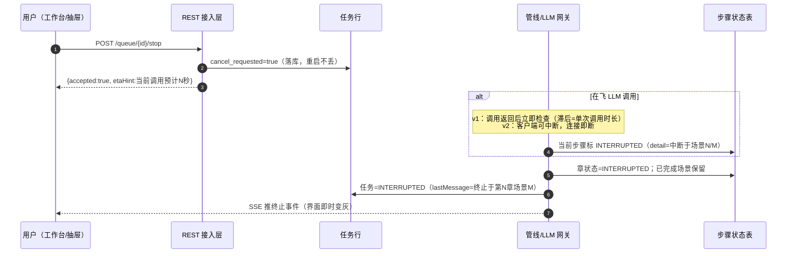
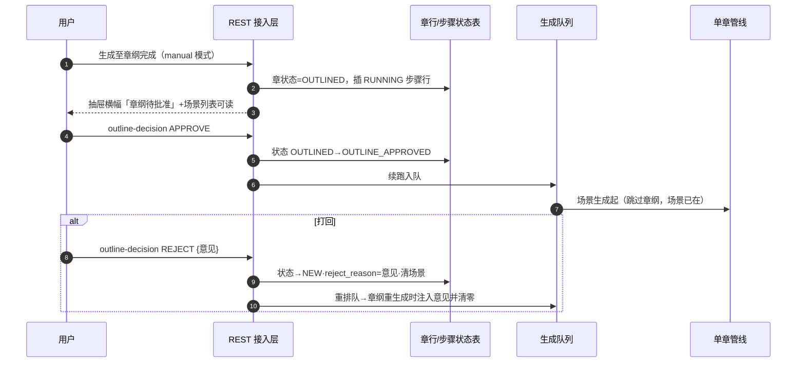
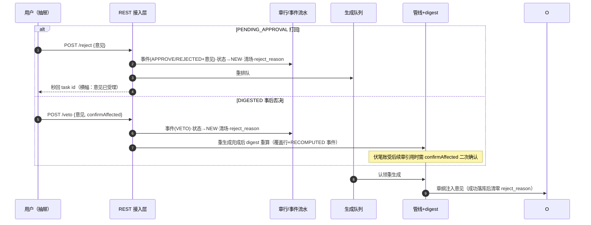
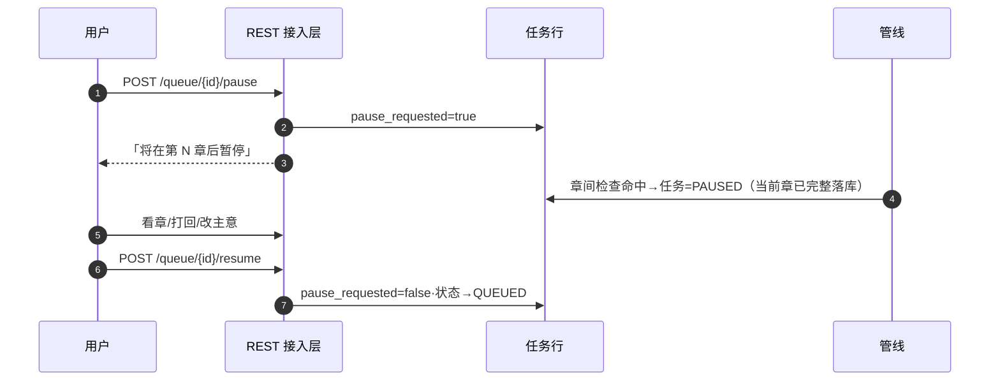
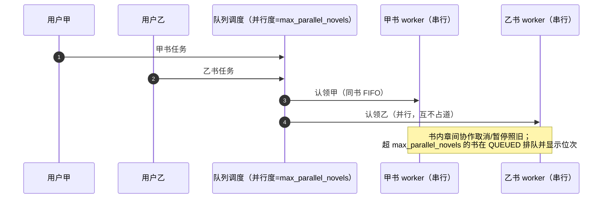
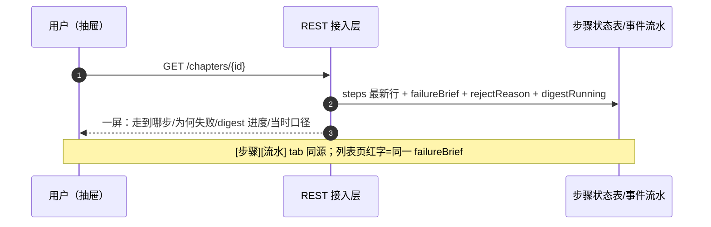

# 契约施工设计（完整修复）v1.0

> 定位：本文是 `docs/architecture/pipeline-contracts.md`（契约）的**施工设计**——数据模型到按钮级全覆盖。
> 与《MVP共识与决策记录》冲突处以共识为准；本文所有"方案"列为默认拍板值，用户可逐条推翻。
> 规格约定：接口给方法/路径/入参/出参/错误码；按钮给位置/显隐条件/行为/反馈/loading；每条流配同规格 mermaid 时序图与验收标准（DoD）。

## 一、批次与范围

| 批次 | 内容 | 依赖 |
|---|---|---|
| ① 地基 | 步骤状态表+失败结构化（契约②④） | 无 |
| ② 停止 | 流 0 硬中断语义 | ① |
| ③ 打回+章纲卡点 | 流 A + 欠账#1（方案 A） | ① |
| ④ digest 解耦 | 事后否决权+插队权 | ① |
| ⑤ 队列分道 | 契约③+长操作任务化 | ① |
| ⑥ 展示收口 | 流 B 一屏读模型 | ① |
| ⑦ 尾欠账 | 流 D/canon 裁决/保留双方版本/回归监控/验收数据 | 按项 |

## 二、数据模型

### V20（替换已搁置文件，语义如下）

```sql
-- 1) 打回意见随章落库
ALTER TABLE chapters ADD COLUMN IF NOT EXISTS reject_reason text;

-- 2) 新状态 INTERRUPTED（重建 CHECK，约束名以库内实际为准）
ALTER TABLE chapters DROP CONSTRAINT chapters_status_check;
ALTER TABLE chapters ADD CONSTRAINT chapters_status_check
  CHECK (status IN ('NEW','OUTLINED','OUTLINE_APPROVED','DRAFTING','GATE_MECHANICAL',
                    'GATE_AI_REVIEW','REVISING','PENDING_APPROVAL','FINAL','DIGESTED',
                    'INDEXED','FAILED','INTERRUPTED'));
```

### V21 步骤状态表（契约②）

```sql
CREATE TABLE chapter_steps (
  id          BIGSERIAL PRIMARY KEY,
  novel_id    BIGINT NOT NULL,
  chapter_id  BIGINT NOT NULL REFERENCES chapters(id),
  chapter_no  INT    NOT NULL,
  step        VARCHAR(32) NOT NULL,   -- OUTLINE/SCENE/ASSEMBLE/READER/AI_REVIEW/APPROVE/DIGEST
  sub_key     VARCHAR(32),            -- 场景号或评审轮次；步级行则为 NULL
  attempt     INT NOT NULL DEFAULT 1, -- 自愈梯子第几次尝试
  status      VARCHAR(16) NOT NULL DEFAULT 'RUNNING', -- RUNNING/DONE/FAILED/INTERRUPTED
  detail      JSONB,                  -- 失败原因原文、产出摘要（结构化失败=契约④）
  is_deleted  BOOLEAN NOT NULL DEFAULT FALSE,
  create_time TIMESTAMPTZ NOT NULL DEFAULT NOW(),
  update_time TIMESTAMPTZ NOT NULL DEFAULT NOW(),
  delete_time TIMESTAMPTZ
);
CREATE INDEX idx_chapter_steps_chapter ON chapter_steps(chapter_id) WHERE is_deleted = FALSE;
```

写入规则：每次尝试**先插 RUNNING 行，步骤终态时更新**；场景级行 sub_key=场景号；失败时 detail={'reason': 原文, 'metrics': {...}}。读取方（断点/详情/队列消息）一律取每 (step, sub_key) 最新 attempt。

### V22 队列任务扩展（契约③+流 0+插队权）

```sql
ALTER TABLE generation_tasks
  ADD COLUMN kind VARCHAR(16) NOT NULL DEFAULT 'CHAPTERS', -- CHAPTERS/PLAN/OUTLINE/REVIEW/DIGEST
  ADD COLUMN payload JSONB,                                -- {forceFresh, reason, volNo...}
  ADD COLUMN cancel_requested BOOLEAN NOT NULL DEFAULT FALSE,
  ADD COLUMN pause_requested BOOLEAN NOT NULL DEFAULT FALSE;
-- status 重建 CHECK：原值 + 'PAUSED'（插队停等）+ 'INTERRUPTED'（被用户硬停）
```

### digest 重算语义（事后否决的地基）

`digests` 一章一行不变；重算=原行内容覆盖更新 + pipeline_events 记 `DIGEST/RECOMPUTED`（含新旧摘要长度）。事实账/世界状态/伏笔的重算规则：重算只替换"该章产出"的行，链上后续章不回溯（v1 语义，明确写在事件里）；伏笔账若该章埋设/回收已被后续章引用，否决对话框需二次确认并列出受影响条目。

### 新表（⑦批）retro_proposals

```sql
CREATE TABLE retro_proposals (
  id BIGSERIAL PRIMARY KEY,
  novel_id BIGINT NOT NULL REFERENCES novels(id),
  vol_no INT NOT NULL,
  kind VARCHAR(16) NOT NULL DEFAULT 'REVIEW',  -- REVIEW 复盘建议 / CANON canon 提案（节点9）
  content TEXT NOT NULL,
  status VARCHAR(16) NOT NULL DEFAULT 'PROPOSED' CHECK (status IN ('PROPOSED','ADOPTED','REJECTED')),
  decision_note TEXT,
  is_deleted BOOLEAN NOT NULL DEFAULT FALSE,
  create_time TIMESTAMPTZ NOT NULL DEFAULT NOW(),
  update_time TIMESTAMPTZ NOT NULL DEFAULT NOW(),
  delete_time TIMESTAMPTZ
);
```

## 三、状态机

**章节**（粗体=本设计新增/改变的转移）：

```
NEW → OUTLINED → [manual: OUTLINE_APPROVED] → GATE_MECHANICAL → GATE_AI_REVIEW
    → (auto: PENDING_APPROVAL 仅审校硬伤时) → PENDING_APPROVAL → DIGESTED
旁路：任意生成步失败 → FAILED；用户停止 → INTERRUPTED
打回：PENDING_APPROVAL --reject--> NEW（reason 落行）
      OUTLINED --reject--> NEW（重出章纲带 reason）
      DIGESTED --veto--> NEW（先重算/标记 digest，意见注入）
```

**任务**：QUEUED → RUNNING → DONE/STOPPED/INTERRUPTED/CANCELED；RUNNING ⇄ PAUSED（插队）。

## 四、新增调参键（全部走 TuningService，fail-open 回退默认）

| 键 | 默认 | 作用 |
|---|---|---|
| `reject_reason_max_len` | 200 | 打回意见注入长度上限，超长截断加「（意见超长已截断）」；前端 maxlength 同源 |
| `batch_max_chapters` | 10 | 连跑上限（共识 M4 欠账） |
| `max_parallel_novels` | 2 | 分道后同时生成的书数上限（MiniMax 限流保护） |

行为键刻意不新增（打回次数等由人决定，不折算阈值）。

## 五、接口契约

| # | 接口 | 入参 | 出参 | 错误 |
|---|---|---|---|---|
| 1 | `POST /api/chapters/{id}/reject` | `{reason}` | `{taskId}` | 空意见 A0001；非 PENDING/OUTLINED 状态 A0006；并发占位失败 A0006 |
| 2 | `POST /api/chapters/{id}/outline-decision` | `{action: APPROVE\|REJECT, reason?}` | `{taskId?}`（打回才有） | 非 OUTLINED A0006 |
| 3 | `POST /api/chapters/{id}/veto` | `{reason}` | `{taskId}` | 非 DIGESTED A0006；受影响伏笔需带 `confirmAffected:true` |
| 4 | `POST /api/chapters/{id}/rerun` | `{mode: RESUME\|FRESH}` | `{taskId}` | 生成中 A0006 |
| 5 | `POST /api/pipeline/queue/{id}/stop` | — | `{accepted, etaHint}` | 无 RUNNING A0006 |
| 6 | `POST /api/pipeline/queue/{id}/pause` / `resume` | — | `{}` | 非 CHAPTERS/非 RUNNING A0006 |
| 7 | `GET /api/chapters/{id}` | — | ChapterDetailVO **扩展**：`steps[]`(step/sub/attempt/status/detailTime)、`rejectReason`、`failureBrief`、`digestRunning` | — |
| 8 | `GET /api/pipeline/queue` | — | 任务行**扩展**：`kind`、`currentStep`、`pauseRequested` | — |
| 9 | `POST /api/volumes/{vol}/retro/{proposalId}/decision` | `{adopt, note?}` | `{}` | 已决 A0006 |
| 10 | `GET /api/novels/{id}/pending-approvals` | — | `[{chapterId, chapterNo, title}]` | — |

说明：`stop`（流 0）取代旧 `/cancel` 的 RUNNING 分支；QUEUED 仍走 `/cancel`。`rerun` 统一断点续跑（RESUME）与全新（FRESH），替代语义含混的 `/pipeline/run` 单章用法（区间连跑入口不变）。

## 六、按钮级交互规格

### 6.1 章节页列表（ChaptersView）

| 控件 | 类型 | 显隐 | 行为 | 反馈 |
|---|---|---|---|---|
| 失败/中断原因 | 新增列 | 仅 FAILED/INTERRUPTED 行 | — | 红字一句话（`failureBrief`），title 悬浮全文 |
| 状态 tag | 已有 | — | — | 新增色：INTERRUPTED=灰、OUTLINED+manual 待批=蓝 |

### 6.2 章节抽屉头部按钮（显隐按状态；顺序即排布顺序）

| 按钮 | 状态 | 行为 | 反馈/loading |
|---|---|---|---|
| [批准章纲] | OUTLINED 且 manual | `outline-decision APPROVE` → 任务入队续跑 | 成功 toast「章纲已批准，生成继续」 |
| [打回章纲…] | OUTLINED 且 manual | prompt 意见 → `outline-decision REJECT` | toast「已打回，重出章纲中」 |
| [通过审批] | PENDING_APPROVAL | 已有 approveAsync，不动 | 已有 |
| [打回…] | PENDING_APPROVAL | prompt 意见（maxlength=`reject_reason_max_len`+字数）→ `reject` | toast「已打回并重新入队」 |
| [事后否决…] | DIGESTED | confirm 列出受影响伏笔 → prompt 意见 → `veto` | toast「已否决，重写并重算账本」 |
| [断点续跑] | FAILED/INTERRUPTED | `rerun RESUME` | toast「从上次位置继续」 |
| [全新重生成…] | FAILED/INTERRUPTED/任意有正文 | confirm「删除场景与正文」→ `rerun FRESH` | toast「已入队」 |
| [复制正文][阅读模式][AI 审校] | 有正文 | 已有，不动 | 已有 |
| [停止] | 本章所在任务 RUNNING | `queue/{id}/stop` | 按钮→「终止中…」→完成 toast「已终止于{步骤}」 |

抽屉横幅（正文 tab 上方，最多同时一条，优先级从高到低）：
1. danger：`failureBrief`（FAILED/INTERRUPTED）
2. warning：`rejectReason` 非空（「上一版打回意见，下次重写生效：…」）
3. info：`digestRunning`（「事实账生成中…」，SSE/轮询驱动自动消失）

抽屉新增 tab：**[步骤]**（表格：步骤/子项/尝试/状态/时间，读 `steps[]`）、**[流水]**（本章 pipeline_events 时间线）。

### 6.3 工作台（WorkbenchView）

| 控件 | 类型 | 显隐 | 行为 | 反馈 |
|---|---|---|---|---|
| 队列行·kind 标签 | 新增列 | — | — | 章节生成/卷纲规划/复盘… |
| 队列行·当前步骤 | 新增列 | RUNNING | — | 「第 57 章·场景 3/4」，读任务扩展+步骤状态 |
| 队列行 [停止] | 新增 | RUNNING | `stop`（硬中断语义） | 行内「终止中…」→ INTERRUPTED |
| 队列行 [取消] | 已有 | QUEUED | 不变 | |
| 队列行 [继续] | 新增 | PAUSED | `resume` | → RUNNING |
| [下一章前暂停] | 新增按钮 | RUNNING 且 kind=CHAPTERS | `pause` | 行内「将在第 N 章后暂停」 |
| 待审批卡片 | 新增卡片 | 有 PENDING_APPROVAL 章 | 跳章节页（带过滤） | 显示 N |
| 提交生成表单 | 已有 | — | 不变（区间连跑） | |

### 6.4 规划页（PlanningView）

| 控件 | 类型 | 显隐 | 行为 | 反馈 |
|---|---|---|---|---|
| [自动规划] | 改异步 | — | 入队 kind=PLAN → 按钮变「排队中」，完成 SSE 通知 | 不再同步等 2-10 分钟 |
| 复盘对话框·每条建议 [采纳][忽略] | 新增 | 报告条目 | `retro/{id}/decision` | 条目状态角标：已采纳/已忽略 |
| 章纲批准/打回 | 同抽屉 | manual 模式 | 同 6.2（同一接口，两处入口） | |

### 6.5 素材库 / 日志页

调参页签自动多 3 行（无需前端改动）；日志页不动（流水已进抽屉）。

## 七、时序图（与流 A 同规格）

### 7.1 流 0：随时停止（硬中断语义）



### 7.2 流 A-1：章纲审批卡点（manual 模式）



### 7.3 流 A-2：终稿打回 / 事后否决



### 7.4 插队权（下一章前暂停）



### 7.5 契约③：按书分道并行



### 7.6 流 B：观察（一屏读模型）



## 八、验收标准（DoD 摘要）

| 流 | DoD |
|---|---|
| 流 0 | RUNNING 任务任意时刻点停止：≤单次 LLM 调用时长内停止；状态=INTERRUPTED 且抽屉可见中断位置；重启后标记仍在 |
| 流 A | 打回后意见原文可在抽屉看到、在下一次章纲提示词中出现（llm_call_log 可验）、消费后清零；批准后生成继续且跳过章纲步 |
| 流 B | 任一 FAILED/INTERRUPTED 章，不离开抽屉回答：走到哪步/为何失败/digest 进度；列表红字同源 |
| 流 C | FRESH 重生成后场景数可为新值且旧正文不存在；RESUME 保留 PASSED 场景并在 UI 明示 |
| 否决 | DIGESTED 章否决后：重生成→digest 重算→事件含 RECOMPUTED；受影响伏笔列出并需确认 |
| 插队 | PAUSED 后队列不再开新章，当前章完整落库；resume 续跑 |
| 分道 | 两书同时 RUNNING 互不阻塞；同书仍串行；并行度受 `max_parallel_novels` 限制 |

## 九、开放问题

1. 打包总量 6-8K 预算键（`scene_pack_max_tokens`）是否本期加——注入源已超设计，建议⑦批一起；
2. 硬中断 v2（LLM 客户端可中断）依赖 RestClient 底层实现，v1 先交付"调用间检查"档；
3. 待核清单七项（design-audit.md §五）验证结果可能微调 ⑦ 批内容。

## 十、工时

对齐前述估算：①3-4 天｜②1-2｜③1-2｜④2-3｜⑤1-2｜⑥1-2｜⑦3-5，合计 12-20 工作日；①②③（5-8 天）后四大原始抱怨消除 80%。
